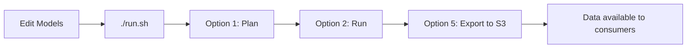

# SQLMesh Data Product: {{ cookiecutter.project_name }}

This data product has been scaffolded by the Data Product Portal provisioner.

## What's included

- `models/` - Example SQL models for SQLMesh (staging & data mart)
- `config.yaml` - SQLMesh configuration with S3 integration
- `export_to_s3.py` - Script to export data to S3 for consumers
- `run.sh` - Interactive pipeline runner
- `example_consumer_access.py` - Shows how consumers read your data
- `.env` - S3 credentials and configuration (generated by provisioner)

## Quick Start

1. **Run the interactive pipeline:**
   ```bash
   chmod +x run.sh
   ./run.sh
   ```

2. **Choose option 2** to run the pipeline (processes the example models)

3. **Choose option 5** to export data to S3 (makes data available to consumers)

## Development Workflow



### 1. Create Your Models

Edit `models/*.py` or create new models:

```python
from sqlmesh import model

@model(
    "staging.my_data",
    kind="FULL",
    columns={"id": "int", "name": "text"}
)
def execute(context, **kwargs):
    return "SELECT 1 as id, 'test' as name"
```

### 2. Test Locally

```bash
./run.sh
> Option 1: Plan changes (preview)
> Option 2: Run pipeline (execute)
```

### 3. Share with Consumers

```bash
./run.sh
> Option 5: Export to S3
```

This creates Parquet files at:
- `s3://{{ cookiecutter.s3_bucket }}/{{ cookiecutter.project_name }}/staging/*.parquet`
- `s3://{{ cookiecutter.s3_bucket }}/{{ cookiecutter.project_name }}/data_mart/*.parquet`

## S3 Integration

### Your S3 Location
- **Bucket**: `{{ cookiecutter.s3_bucket }}`
- **Prefix**: `{{ cookiecutter.project_name }}`
- **Endpoint**: `{{ cookiecutter.s3_endpoint }}`

### How It Works

1. **Local development**: SQLMesh uses local DuckDB (`cnt_survey.duckdb`) for fast iterations
2. **Data sharing**: `export_to_s3.py` pushes all tables to S3 as Parquet files
3. **Consumer access**: Other data products read your Parquet files from S3

This is the standard pattern used by Spark, dbt, and other modern data tools.

## Development Environments

Access your project in:
- **VS Code (Coder)**: http://localhost:8443 (password: `coder`)
- **RStudio**: http://localhost:8787 (username: `rstudio`, password: `rstudio`)

Both have your project folder mounted and can access S3.

## Consumer Access

See `example_consumer_access.py` for how other data products can read your data:

```python
import duckdb
conn = duckdb.connect()

# Read your exported data
df = conn.execute("""
    SELECT * FROM 's3://{{ cookiecutter.s3_bucket }}/{{ cookiecutter.project_name }}/data_mart/example_summary.parquet'
""").df()
```

## Next Steps

1. ✅ Replace example models with your actual data transformations
2. ✅ Add source data (CSV, Parquet, API connections, etc.)
3. ✅ Create meaningful staging and data mart models
4. ✅ Run and export to S3 regularly
5. ✅ Share your S3 location with consumers via the portal

## Learn More

- [SQLMesh Documentation](https://sqlmesh.readthedocs.io/)
- [DuckDB S3 Support](https://duckdb.org/docs/guides/import/s3_import.html)
- [Data Product Portal]({{ cookiecutter.portal_url }})
