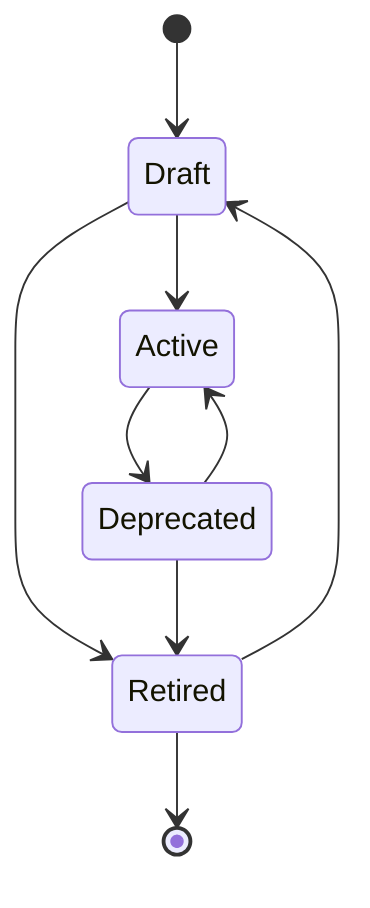

# Output Port Lifecycle Management

## Context and Problem Statement

Data Producers want to have the ability to control the visibility of their Output Ports during development.
Data Consumers want to have visibility on the state of a Data Output, in order to estimate if it is a good fit.

## Decision Drivers

* Ease of use
* Control for the Data Producer
* Clarity for the Data Consumer

## Considered Options

* **Option 1: Simple toggle** A data output can be switched between 'draft' and 'published'.
  Draft data outputs are not visible to people outside the data product, published outputs are visible.
* **Option 2: State machine** A data output has four states: 'draft', 'active', 'deprecated' and 'retired'.
  The addition of the deprecated and retired states over the simple toggle allows existing consumers to be gradually moved away from the data output.

## Decision Outcome

**Chosen option:** *Option 2: State machine*.
A simple toggle for the visibility is insufficient to properly manage consumer expectations.
The addition of more explicit states allows producers to manage the lifecycle of their outputs in a more gradual way,
resulting in clearer communication towards the data consumers, and success in meeting expectations.

## Confirmation

We will introduce a lifecycle property on the Data Output model.
This property can take the form of four stages.

#### Draft

Lifecycle for a newly created Data Output. Not visible yet to outside consumers, so cannot be requested.
Consumers can be added by invitation in order to test a new Data Output while it’s still under development.

#### Active

Data Output is published and visible in the Marketplace. Consumers can view and request the Output.

#### Deprecated

The Data Output is no longer maintained. It should not be listed in the Marketplace anymore.
Consumers that already have access can still view and access the output, but it cannot be requested by new Consumers, not even by invitation.

#### Retired

The data output has reached End-of-Life. By moving to this stage, all remaining consumers are removed (should be done with an explicit approval in case there are still consumers). At this point, only the team working on the parent Data Product can still view this Data Output. The team can now decide to remove the Data Output from portal altogether. Removal should not be possible in other lifecycle stages.

### Constraints

- Data Outputs can only be removed in the Retired stage, when they are guaranteed to no longer have consumers.
- Data Outputs that are in draft (with consumers) can go directly to Retired if the producer does not want to move forward with publishing.
- Once a Data Output has left the Draft phase to Active, it cannot move back.
- Data Outputs can only reach Retired from Deprecated.
- Data Outputs that are Deprecated can move back to Active should the product team decide so.
- A Retired data output can move back to Draft should the product team decide so.

## Pros and Cons of the Options

### Option 1: Simple toggle

* **Good, because** there is little implementation effort
* **Good, because** it is conceptually very simple
* **Bad, because** it provides no guidance how to gradually remove a data output
* **Bad, because** it provides no signal to consumers if they should keep using the output or not

### Option 2: State machine

* **Good, because** we provide an opinion on how the lifecycle of a data output should be managed instead of only controlling visibility
* **Good, because** the lifecycle can be used to notify consumers, and provide a gentle path towards the EOL of a data output
* **Neutral, because** the state transitions need to be correctly modelled, so the implementation effort is higher
* **Neutral, because** data producers need to understand the process that portal offers
