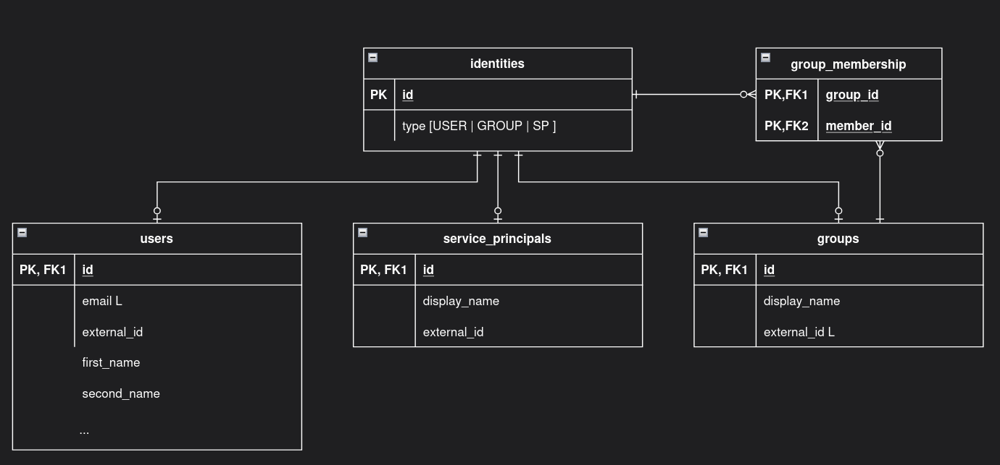

# Support Groups and Machine Users as Assignable Identities

## Context and Problem Statement

Portal currently represents users as the only type of identity. Global and Data Product role assignments reference `users.id`, meaning groups and machine users
cannot receive these roles.

Portal wants to extend its authorization model so a Global or Data Product role can be assigned to a user, group or machine user. If a group receives a role,
every user belonging to that group must inherit the related permissions and visibility as if the assignment had been made directly to the user.

Only users can authenticate and operate Portal. Groups and machine users are non-interactive identities that can receive role assignments, while users and
machine users can be members of groups.

Explorations currently use a user-specific ownership model and can therefore only be owned and operated by users. Extending Explorations to support the common
Identity model requires a separate refactoring and is outside the scope of this decision.

Portal needs also a way to introduce these identities from an external identity provider and a way to expose them through the API.

## Decision Drivers

* Allow users, groups and machine users to receive Global and Data Product roles through the same assignment model.
* Keep users as the only identity type that can authenticate and operate Portal.
* Grant users permissions and Data Product visibility inherited from their groups.
* Use a standard protocol for synchronizing users, groups and memberships.
* Support machine users even when they are not available through SCIM.
* Provide provider-agnostic APIs for identities, memberships and Data Product role assignments.
* Preserve existing user-linked workflow and audit relationships.
* Avoid nested-group resolution, as the supported identity provider supplies flat memberships.
* Keep the current user-specific Exploration model unchanged.

## Considered Options

* **Option 1: Common Identity with separate subtype tables** — add an `identities` table referenced by `users`, `groups` and `machine_users`, with each subtype
  using the Identity ID as its primary and foreign key.
* **Option 2: Single Identities table** — store users, groups and machine users in one table, using a type discriminator and nullable type-specific columns.

For synchronization:

* **Option A: Custom Portal synchronization API** — receive every identity type and membership through Portal-specific API operations.
* **Option B: SCIM interface with a Machine User API** — receive users, groups and memberships through SCIM and receive machine users through a Portal-specific
  API.

## Decision Outcome

**Chosen options:** *Option 1: Common Identity with separate subtype tables* and *Option B: SCIM interface with a Machine User API*.

A common Identity provides one target for Global and Data Product role assignments while keeping the attributes and behaviour of users, groups and machine users
separated. Only users can authenticate, request or approve changes and act inside Portal, while every identity type can receive roles and both users and machine
users can belong to groups.

Portal will implement a SCIM interface for users, groups and group memberships. Machine users and their memberships will be created and updated through
authenticated and idempotent Portal API operations until they can be synchronized through SCIM. Both entry points will use the same internal identity services
and persistence model.

Explorations remain owned and operated by individual users. Their ownership and authorization model is not migrated to the common Identity model as part of this
decision.

### Confirmation

* The database contains `identities`, `users`, `groups`, `machine_users` and `group_memberships`.
* Global and Data Product role assignments reference `identities.id`.
* Workflow fields such as `requested_by_id` and `decided_by_id` continue to reference users.
* A user receives access from both direct role assignments and roles assigned to their groups.
* Global authorization and Data Product visibility consider the groups of the authenticated user.
* Explorations continue to use their existing user-specific ownership model.
* SCIM endpoints support the user, group and membership operations required by the identity provider.
* The Portal API supports creating and updating machine users and their group memberships.
* Read endpoints expose users, groups, machine users and group memberships.
* Data Product role-assignment responses include the assigned identity and its type.
* The generated SDK includes the new Portal API operations.

## Pros and Cons of the Options

### Option 1: Common Identity with separate subtype tables

* **Good, because** it provides one consistent target for Global and Data Product role assignments.
* **Good, because** type-specific attributes and relationships remain in separate tables.
* **Good, because** users remain separated from identities that cannot authenticate.
* **Good, because** group membership can reference both users and machine users.
* **Neutral, because** reading a complete identity requires joining its common and type-specific tables.
* **Bad, because** parent and subtype rows must be managed in the same transaction.
* **Bad, because** Portal must validate that every Identity has exactly one subtype matching its type.
* **Bad, because** it introduces more tables and relationships than a single-table model.

### Option 2: Single Identities table

* **Good, because** it requires fewer tables and joins.
* **Good, because** there is no possibility of a missing subtype row.
* **Neutral, because** application code must use the type discriminator to interpret each identity.
* **Bad, because** type-specific columns remain null for other identity types.
* **Bad, because** user-only relationships and constraints become harder to enforce.
* **Bad, because** existing Portal code assumes a dedicated User model for authentication, notifications and workflows.

### Option A: Custom Portal synchronization API

* **Good, because** every identity type follows the same synchronization contract.
* **Good, because** Portal keeps control over validation and database writes.
* **Bad, because** it requires designing and maintaining a custom synchronization protocol.
* **Bad, because** identity providers require a custom integration instead of using their existing SCIM support.

### Option B: SCIM interface with a Machine User API

* **Good, because** SCIM provides a standard interface for users, groups and memberships.
* **Good, because** the identity provider pushes changes without Portal scheduling provider queries.
* **Good, because** the custom API remains limited to identities not available through SCIM.
* **Good, because** Portal remains the only component with direct database access.
* **Neutral, because** SCIM and the Machine User API are separate entry points into the same identity model.
* **Bad, because** two synchronization mechanisms must coexist while machine users are not available through SCIM.
* **Bad, because** Portal must prevent duplicates between SCIM, the Machine User API and login-time user creation.

## Design Details

### Identity model

The common table holds the Portal identity and its type. Users, groups and machine users use the Identity ID as their primary key and as a foreign key to
`identities.id`.



`group_memberships` uses `(group_id, member_identity_id)` as its composite primary key. Portal accepts users and machine users as members and rejects groups as
members. This matches the flat memberships supplied by the supported identity provider and avoids introducing recursive group resolution.

Global and Data Product role assignments reference the common identity:

```text
Identity → Global role
Identity → Data Product role
```

Fields that represent assignment targets reference identities, while fields that represent Portal actors remain attached to users:

```text
identity_id      → identities.id
requested_by_id  → users.id
decided_by_id    → users.id
```

Existing Global and Data Product role assignments must be migrated by creating an Identity row for every existing user and replacing their assignment `user_id`
references with the corresponding `identity_id`.

Explorations remain associated with users through their existing ownership model. Their relationships are not migrated to `identities.id` by this decision.

### Effective authorization and visibility

For an authenticated user, Portal resolves the user identity and the groups of which the user is a direct member:

```text
effective identities = user identity + group identities
```

Global and Data Product authorization succeeds when the user identity or any of those group identities has the required approved role assignment. Groups and
machine users do not authenticate and are therefore never resolved as Portal actors.

The same effective identities must be used for Data Product visibility. A group assignment to a Data Product makes that Data Product and the resources governed
by the assigned role visible to the users belonging to the group.

Machine users can receive Global and Data Product assignments, but they cannot exercise those permissions inside Portal because they cannot authenticate. Their
assignments remain available through the common persistence and API models.

Changes to group membership and role assignments must invalidate affected authorization decisions. This must work across backend instances and cannot depend
only on clearing an in-process cache.

### Exploration scope boundary

Explorations remain personal resources owned and operated by authenticated users. The current Exploration model references `users.id`, and its authorization
checks compare the owner with the authenticated user.

Supporting groups or machine users in this relationship would require refactoring Exploration ownership and authorization to use the common Identity model. The
expected roles, sharing behaviour and inherited permissions require a separate decision and are not defined in this ADR.

### SCIM interface

Portal exposes a SCIM v2 interface for users and groups, including the discovery endpoints required by the identity provider:

```text
/scim/v2/Users
/scim/v2/Groups
/scim/v2/ServiceProviderConfig
/scim/v2/ResourceTypes
/scim/v2/Schemas
```

The interface supports the filtering, pagination and PATCH operations required by the supported SCIM integration. Group membership is received through the SCIM
Group resource and stored in `group_memberships`.

Portal uses its own Identity UUID as the SCIM resource `id` and stores the identity-provider identifier separately as `externalId`. SCIM operations use the same
internal identity services as the rest of Portal.

Login-time user creation remains supported. SCIM must reconcile with an existing user when both records represent the same external identity instead of creating
a duplicate.

### Portal API

Portal adds authenticated and idempotent operations for creating and updating machine users and their group memberships. Stable external identifiers are used so
the operations can be safely retried.

Portal also exposes paginated read operations for:

* Users.
* Groups and their members.
* Machine users.
* Data Product role assignments.

The existing `GET /v2/users` operation can be extended where needed instead of adding another user-list endpoint. New operations for groups, memberships and
machine users follow the same `/v2` API conventions.

Data Product role-assignment responses embed the assigned identity and its type. For example, when Group A is Developer of a Data Product, the response contains
Group A rather than expanding it into its members:

```json
{
  "data_product_id": "data-product-id",
  "role": {
    "id": "role-id",
    "name": "developer"
  },
  "identity": {
    "id": "identity-id",
    "type": "group",
    "external_id": "external-group-id",
    "display_name": "Group A"
  },
  "decision": "approved"
}
```

Embedding the identity avoids an additional lookup while preserving the original assignment.

Global role assignments are not added to the external read API because they only affect authorization inside Portal.

## Consequences

Portal gains a common Identity model where users, groups and machine users can receive Global and Data Product roles without losing the separation between
interactive users and non-interactive identities. This requires migrating existing Global and Data Product assignments and updating the corresponding models,
schemas, events and authorization services.

Group membership becomes part of Portal’s authorization state. A user can receive access directly or through any of their flat groups, and Data Product
visibility must follow the same rule to avoid differences between what the user can access and what Portal shows.

Explorations remain limited to users through their existing ownership model. Allowing other identity types to own or receive access to Explorations will require
a separate refactoring and architectural decision.

Users, groups and memberships are primarily managed through SCIM, while machine users temporarily use Portal-specific API operations. Both paths share the same
internal identity services and must reconcile with login-time user creation to avoid duplicated records.

Portal’s read API exposes the original assigned identity and its type without expanding group membership. This keeps the API generic while allowing clients to
combine identities, memberships and Data Product role assignments for their own use cases.