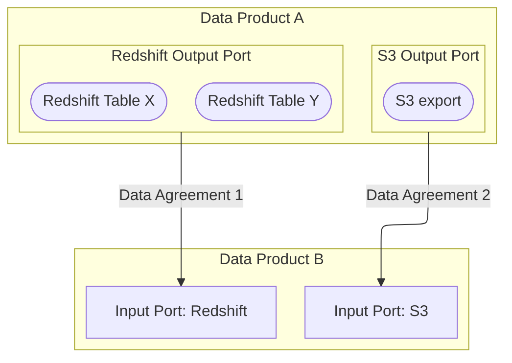

# 🔗 How Concepts Link Together

Here’s how **Data Products**, **Technical Assets**, **Output Ports**, and **Input Ports** all fit into the broader architecture:

## 🧭 Flow Overview

## 🔁 Example Walkthrough

1. **Data Product A** produces three technical assets: two Redshift tables and an S3 export.
2. These technical assets are grouped into two **Output Ports**: one port providing access to the two Redshift tables and another port providing access to the S3 export.
3. **Data Product B** wants access to both Output Ports. A separate request is made for each Output Port.
4. Data Product A can separately evaluate and approve these requests. When approved, these requests are recorded in the Data Agreement.
5. Now, Data Product B can use the data exposed by Data Product A as source for its own data processing.

## 🎯 Benefits

- Clear **ownership boundaries**
- **Composable** architecture
- **Request-based sharing** with full governance
- Easily auditable and traceable

## Representation
In the Explorer view you can always look at the lineage between **Data Products**, **Output Ports** and **Technical Assets**
Pay attention to the shapes of each element to rapidly distinguish its type.

---
