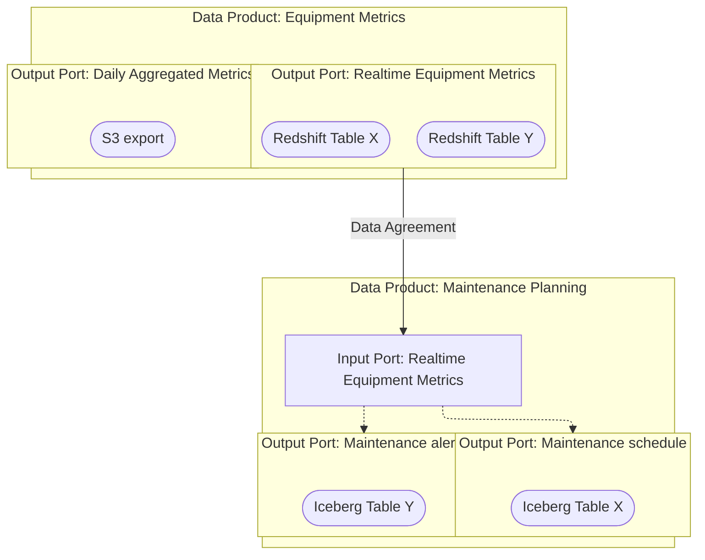

# 🔗 How Concepts Link Together

Here’s how **Data Products**, **Technical Assets**, **Output Ports**, and **Input Ports** all fit into the broader architecture:

## 🧭 Flow Overview

## 🔁 Example Walkthrough

1. The **Equipment Metrics Data Product** produces three technical assets: two Redshift tables and an S3 export.
2. These technical assets are grouped into two **Output Ports**: one port providing access to the Realtime Equipment Metrics and another port providing access to the Daily Aggregated Metrics.
3. The **Maintenance Planning Data Product** wants access to the Realtime Equipment Metrics Output Port. A request is made specifically to this Output Port.
4. The **Equipment Metrics Data Product** can evaluate and approve this request in isolation. When approved, this request is recorded in the Data Agreement linked to the Input Port.
5. Now, the **Maintenance Planning Data Product** can use the data exposed by the **Equipment Metrics Data Product** as source for its own data processing.
6. The **Maintenance Planning Data Product** exposes two Output Ports of its own: **Maintenance Alerts** and **Maintenance Schedule**.

## 🎯 Benefits

- Clear **ownership boundaries**
- **Composable** architecture
- **Request-based sharing** with full governance
- Easily auditable and traceable

## Representation
In the Explorer view you can always look at the lineage between **Data Products**, **Output Ports** and **Technical Assets**
Pay attention to the shapes of each element to rapidly distinguish its type.

---
