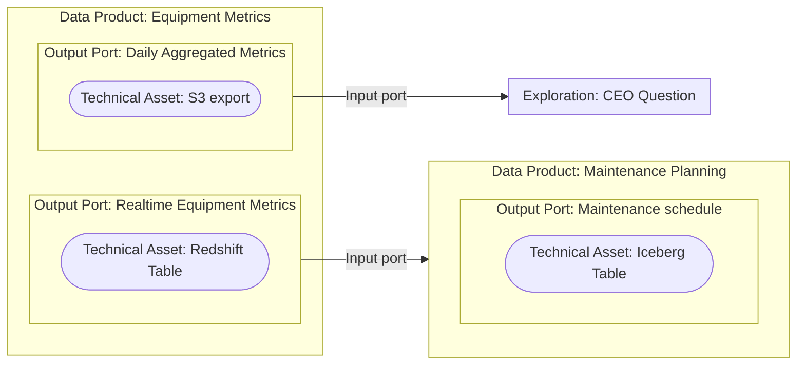
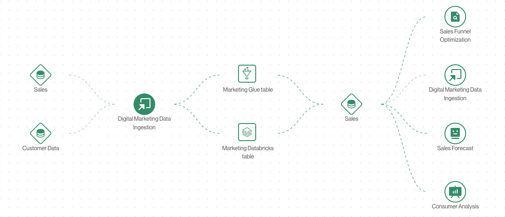

# 🔗 How Concepts Link Together

Here’s how **[Data Products](./data-products)**, **[Explorations](./explorations)**, **[Technical Assets](./technical-assets)**,
**[Output Ports](./output-ports)**, and **[Input Ports](./input-ports)** all fit into the broader architecture:

## 🧭 Flow Overview

```mermaid
---
config:
  flowchart:
    subGraphTitleMargin:
      bottom: 5
---
flowchart LR
    subgraph op1["Output Port: Realtime Equipment Metrics"]
        ta1(["Technical Asset: Redshift Table"])
    end
    subgraph op2["Output Port: Daily Aggregated Metrics"]
        ta3(["Technical Asset: S3 export"])
    end
    subgraph op3["Output Port: Maintenance schedule"]
        ta4(["Technical Asset: Iceberg Table"])
    end
    subgraph dp1["Data Product: Equipment Metrics"]
        op1
        op2
    end
    subgraph dp2["Data Product: Maintenance Planning"]
        op3
    end
    subgraph exp["Exploration: CEO Question"]
    end
    op1 -- Input port --> dp2
    op2 -- Input port --> exp
```

## Example Walkthrough

### Data Product: Equipment Metrics

Produces two technical assets: A Redshift table and an S3 export.
They are grouped into two Output Ports: one port providing access to the Realtime Equipment Metrics and another port providing access to the Daily Aggregated Metrics.

### Data Product: Maintenance Planning

This has access to the Realtime Equipment Metrics Output Port. Such an access request is called an input port.
It itself has a single Output Port: Maintenance Schedule that is exposed but currently unused by others.

### Exploration: CEO Question

The Exploration CEO question has only one Input Port: Daily Aggregated Metrics. An exploration itself cannot
share any data, so it has no technical assets or Output Ports.

## Representation
In the Explorer view you can always look at the lineage between **Data Products**, **Output Ports** and **Technical Assets**
Pay attention to the shapes of each element to rapidly distinguish its type.

---
