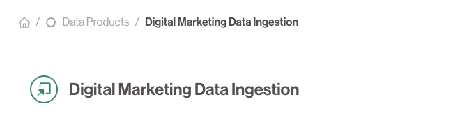

# 🔵 Data Products

**Data Products** are the fundamental building blocks of the Data Product Portal. They are owned, governed, and managed units of data that expose outputs and can consume datasets as inputs.

## 🔍 Key Characteristics

- **Ownership**: Each data product has a clearly defined owner responsible for quality and compliance.
- **Autonomy**: Data products are independently deployable and testable.
- **Purpose-Driven**: Every data product serves a specific use case or business objective.
- **Lifecycle Managed**: From creation to deprecation, data products go through a full lifecycle.

## 🛠 What They Can Do

- Produce and expose **Data Outputs** (e.g. tables, APIs, files)
- Request and consume **Datasets** from other data products
- Implement fine-grained access control, observability, and versioning

## 📸 Example
A "Sales Transactions" data product may expose:
- A PostgreSQL table
- An S3 file export
- A REST API endpoint

These are all **Data Outputs** managed by the data product.

## Representation
Within the Data Product Portal UI **Data Products** are always represented as **Circles**

---
