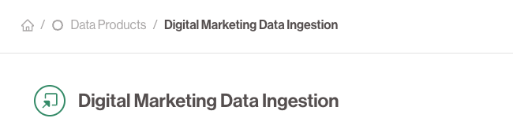

# Data Products

**Data Products** are the fundamental building blocks of the Data Product Portal.
Their goal is to facilitate and simplify data management.

A Data Product can be thought of as a container that brings together people, technology and data.
It is governed and maintained by a group of people, who are responsible for assuring the quality of the product.
A Data Product can consume data from other products through **[Input Ports](./input-ports)**, and expose data to other products via **[Output Ports](./output-ports)**.
Data does not exist in a void, but it is tied to certain storage infrastructure, and transformed through data pipelines defined in code.
These technical aspects are also governed by the Data Product concept.

## Key Characteristics

- **Ownership**: Each Data Product has a clearly defined owner responsible for quality and compliance.
- **Autonomy**: Data products are independently deployable and testable.
- **Purpose-Driven**: Every Data Product serves a specific use case or business objective.
- **Lifecycle Managed**: From creation to deprecation, Data Products go through a full lifecycle.

## What They Can Do

- Produce [Technical Assets](./technical-assets) (e.g. tables, APIs, files) that are exposed through **[Output Ports](./output-ports)**
- Register **[Input Ports](./input-ports)** by requesting access to the **[Output Ports](./output-ports)** of other Data products
- Implement fine-grained access control, observability, and versioning on **[Output Ports](./output-ports)**

## Example

A "Sales Transactions" Data Product may expose:
- A PostgreSQL table
- An S3 file export
- A REST API endpoint

These are all **[Technical Assets](./technical-assets)** managed by the Data Product.
By default, all technical assets are private to the Data Product that manages them.
In order to share these assets with the outside world, they need to be exposed via an **[Output Port](./output-ports)**.

## Representation
Within the Data Product Portal UI **Data Products** are always represented as **Circles**

---
