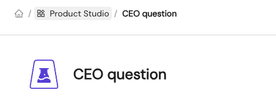

# Explorations

**Explorations** are great when you want to answer a one-time question, or need a personal sandbox to experiment.
They do not allow you to share any data with others. Hence they do not support [Output Ports](./output-ports) or [Technical
Assets](./technical-assets).

They do support [Input Ports](./input-ports) since these are the way to get access to data.

This enables you to track where data is used throughout the organisation, even for simple one-time questions.

## Representation
Within the Data Product Portal UI **Explorations** are always represented as **Trapezoids**

