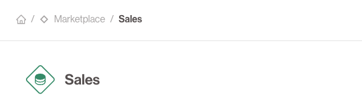

# 🔷 Output Ports

**Output Ports** are the abstraction used by Data Products to share technical assets with the outside world in a structured way.
They can be thought of as a logical grouping of **Technical Assets** that serve as the primary unit of data access and sharing in the portal.

They allow **data consumers** (other data products) to request and consume governed collections of data.

## 🧩 What is in an Output Port?

An Output Port might contain:
- An S3 export
- A collection of SQL tables
- One or more API endpoints
- Metadata, descriptions, schema information

## 🔐 Access Management

- Access to Output Ports must be **requested and approved**.
- Approvals go through the owner of the Output Port.
- Once access is granted, the Output Port gets registered as an Input Port of the consuming Data Product.

## 💎 Quality Control

Data Contracts can be put in place on an Output Port.
This offers an additional way for data owners to communicate expectations to their consumers.

The possibility exists for a Data Product to offer Output Ports that expose similar data, but with different quality guarantees.
One could for instance expose an Output Port that exposes data for reading as soon as it is available, but with little to no guarantees about the quality.
A second Output Port, with a different contract, can be offered that only exposes the data after the data quality checks have completed.
This offers a higher quality guarantee, at the expense of speed.

## ♻️ Reusability

Output Ports enable **composability**: the output of one data product becomes the input to another.

## Representation

Within the Data Product Portal UI **Output Ports** are always represented as **Diamonds**

---
