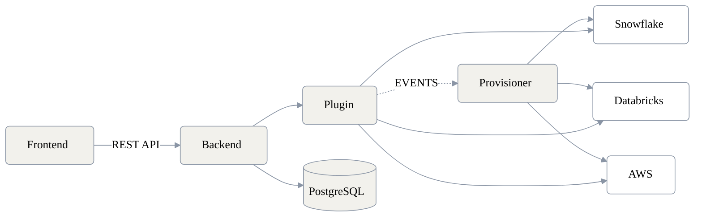

# Architecture Overview

The Data Product Portal is composed of several distinct components that work together to provide a self-service data product management platform.

## Diagram



## Components

### Frontend

A React single-page application that provides the user interface for managing data products, datasets, and data outputs. It communicates with the backend exclusively through the REST API.

### Backend

A FastAPI application that contains the core business logic and exposes the REST API consumed by the frontend and external clients (CLI, MCP server). It persists state in a PostgreSQL database.

When relevant API calls complete successfully, the backend emits a webhook event to the configured provisioner endpoint.

### Plugin

The backend supports a **plugin system** that allows platform-specific behaviour to be injected without modifying core logic. Plugins handle concerns such as data output configuration, technical asset validation, and platform-specific mappings (e.g. S3 paths, Glue tables, Snowflake schemas).

Plugins are configured via the `ENABLED_PLUGINS` environment variable.

### Database

A **PostgreSQL** database that stores all portal state: data products, datasets, data outputs, users, environments, and RBAC policies.

### Provisioner

The provisioner is an external HTTP service that receives webhook events from the backend and translates portal state changes into actual infrastructure changes on the target data platform (Snowflake, Databricks, AWS, etc.).

The provisioner is **intentionally decoupled** from the backend — the backend only emits events, the provisioner acts on them. This means the provisioner is always a **custom-built service** tailored to your organisation's platform setup. A provisioner SDK to simplify building provisioners is currently in development.

A reference implementation is available in [`demo/basic/provisioner/`](https://github.com/conveyordata/data-product-portal/tree/main/demo/basic/provisioner).

## Webhook Configuration

Configure the following environment variables on the **backend** to enable the webhook:

| Variable | Required | Description |
|---|---|---|
| `WEBHOOK_URL` | Yes | URL of your provisioner's webhook endpoint (e.g. `http://provisioner:6060`) |
| `WEBHOOK_SECRET` | No | Shared secret used to sign requests (HMAC-SHA512, sent in the `Sign` header) |

### Webhook Payload

Every event is a `POST` request to `WEBHOOK_URL` with a JSON body mirroring the original API call that triggered it:

```json
{
  "method": "POST",
  "url": "/api/v2/data_products",
  "query": "",
  "response": "{\"id\": \"97a3bf4c-12b9-4f03-aff5-8917aef0b0e7\"}",
  "status_code": 200
}
```

The provisioner can use the `method` + `url` combination to route the event to the right handler, and call back into the portal's REST API using the IDs in `response` to fetch full resource details.

### Request Signing

When `WEBHOOK_SECRET` is set, the backend adds a `Sign` header to every webhook request containing the HMAC-SHA512 signature of the JSON body. Verify this header in your provisioner to ensure requests are authentic.

## Communication Flow

1. A user interacts with the **Frontend**, which calls the **Backend** via REST API.
2. The **Backend** validates the request, applies RBAC rules, and persists changes to **PostgreSQL**.
3. When a provisioning-relevant change occurs (e.g. a data product is created, a data output is approved), the **Backend** sends a webhook event to the **Provisioner**.
4. The **Provisioner** receives the event, optionally calls back into the portal API for full resource details, and applies the corresponding changes on the target platform.
