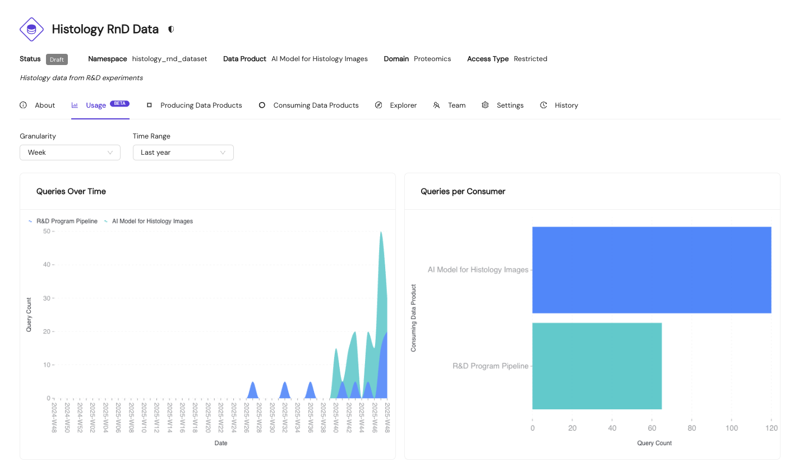

# Data Product Usage Ingestion

The Data Product Portal provides a **usage analytics** view that allows one to track how datasets are being consumed over time. This feature enables visibility into query patterns, data-consumer behavior, and usage trends.

## Overview

To enable the usage analytics, the usage related tables have to be populated with statistics from your data platform (e.g., Snowflake, Databricks, AWS). Once ingested, this data is displayed in the portal's usage dashboards, providing insights into:

- **Query trends over time**: Track how query volumes change across different time periods
- **Consumer distribution**: Understand which data products are consuming your datasets
- **Usage patterns**: Identify peak usage periods and consumption trends

A simple example is shown below:



The dashboard above demonstrates how usage data is visualized, with filters for granularity (day, week, month) and time ranges (7 days, 30 days, 90 days, 1 year).

## API Endpoint

To ingest usage data, use the following REST API endpoint:

### Endpoint

- [`PATCH /api/datasets/{id}/query_stats`](/docs/api/#tag/datasets/operation/update_query_stats_api_datasets__id__query_stats_patch) - Update query statistics
- [`DELETE /api/datasets/{id}/query_stats`](/docs/api/#tag/datasets/operation/delete_query_stat_api_datasets__id__query_stats_delete) - Delete query statistics

### Request Payload

The endpoint accepts a JSON payload containing an array of daily query statistics:

```json
{
  "dataset_query_stats_daily_updates": [
    {
      "date": "2025-01-15",
      "consumer_data_product_id": "550e8400-e29b-41d4-a716-446655440000",
      "query_count": 42
    },
    {
      "date": "2025-01-15",
      "consumer_data_product_id": "660e8400-e29b-41d4-a716-446655440001",
      "query_count": 18
    }
  ]
}
```

### Field Descriptions

- **`date`** (string, required): The date for which the statistics apply, in `YYYY-MM-DD` format
- **`consumer_data_product_id`** (UUID, required): The unique identifier of the consuming data product
- **`query_count`** (integer, required): The number of queries executed on the specified date


## Responsibility and Implementation

**Implementation responsibility**: The ingestion of usage metrics is the responsibility of the data product owner or platform administrator. You are responsible for:

- Extracting usage data from your data platform's query logs or access history
- Aggregating the data by date and consumer
- Implementing the HTTP client logic (authentication, request formatting, error handling, retries)
- Scheduling the ingestion process (e.g., daily batch jobs)

The Data Product Portal provides the API endpoint and documentation, but the actual data extraction, transformation, and ingestion pipeline must be implemented within your infrastructure.

## Snowflake Example

For organizations using Snowflake, we provide a sample SQL query that can be used as a starting point to extract usage statistics from Snowflake's `ACCESS_HISTORY` view. This query identifies which schemas were accessed by specific roles and aggregates query counts by consumer.

**Note**: This query requires Snowflake Enterprise Edition or higher, as it uses the `ACCESS_HISTORY` view.

We advise to use this query on a (daily) schedule.

```sql
WITH AccessLogRaw AS (
    SELECT
        ah.QUERY_ID,
        ah.USER_NAME,
        ah.QUERY_START_TIME,
        o.value:objectName::string AS full_object_name,
        SPLIT_PART(o.value:objectName::string, '.', 1) AS database_name,
        SPLIT_PART(o.value:objectName::string, '.', 2) AS schema_name
    FROM SNOWFLAKE.ACCOUNT_USAGE.ACCESS_HISTORY ah,
         LATERAL FLATTEN(input => ah.DIRECT_OBJECTS_ACCESSED) o
    WHERE ah.QUERY_START_TIME >= TO_TIMESTAMP_LTZ('{{ start_ts }}')
      AND ah.QUERY_START_TIME < TO_TIMESTAMP_LTZ('{{ end_ts }}')
)
, AccessLogFiltered AS (
    SELECT
        QUERY_ID,
        USER_NAME,
        QUERY_START_TIME,
        full_object_name,
        database_name,
        schema_name
    FROM AccessLogRaw
    WHERE UPPER(schema_name) NOT IN ('INFORMATION_SCHEMA', 'PUBLIC')
)
SELECT
    schema_name,
    user_name,
    COUNT(DISTINCT QUERY_ID) AS total_unique_queries
FROM AccessLogFiltered
GROUP BY 1, 2
ORDER BY schema_name, total_unique_queries DESC
```

### Query Parameters

Replace the following placeholders in the query:

- **`{{ start_ts }}`**: Start timestamp for the time window (e.g., `'2025-01-15 00:00:00'`)
- **`{{ end_ts }}`**: End timestamp for the time window (e.g., `'2025-01-16 00:00:00'`)
