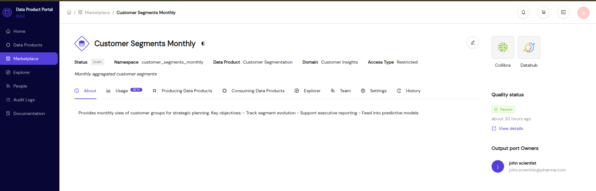

# Output port Data Quality information

The goal of Portal is to provide data product consumers with all necessary information to understand whether an output port fits their needs.
The goal of this feature is to provide a quick overview of the data quality status of an output port

The idea is similar to Github badges showing the overall status of CICD pipelines of a Github repository without all the details but than for Data products.

## Data quality summary
The data quality summary give a high level overview of the data quality status of an output port with its respective technical assets.
We only show the overview and support linking to the actual quality run as Portal is not becoming a data quality tool itself.
The format looks as follows:
```json
{
  "created_at": "2026-01-12T08:15:00Z",
  "overall_status": "fail",
  "summary": "Optional extra user info",
  "technical_assets": [
    {
      "name": "orders",
      "status": "pass"
    },
    {
      "name": "order_items",
      "status": "warn"
    },
    {
      "name": "customers",
      "status": "fail"
    }
  ],
  "dimensions": {
    "completeness": "warn",
    "validity": "pass"
  },
  "details_url": "https://ci.company.com/runs/123"
}
```

## Visualizing data quality

In a first version, we show the overall data quality status on an output port with a link to the detailed run details (e.g. Soda UI, CICD run,...)
This looks as follows:



## Ingesting data quality data

To ingest the data quality data, you need to:

1. Extract the data quality summary from the run results of your data quality tool
2. Implement the HTTP client logic (authentication, request formatting, error handling, retries) to push the data to the API endpoint

### Extracting data quality summary from run results

We aim to integrate with the existing tooling for data quality reporting (e.g. dbt, Soda, Great Expectations,...).
As a consequence, you should generate the data quality summary from the run results of your data quality tool.
To show how this could work, we have provided several example scripts to process the `run_results.json` from your data quality tool:

- [dbt example](https://github.com/conveyordata/data-product-portal/blob/main/integrations/data_quality/extract_dbt_summary.py)
- [Soda example](https://github.com/conveyordata/data-product-portal/blob/main/integrations/data_quality/extract_soda_summary.py)

### Ingesting data quality summary in Portal

In order to display the data quality status of an output port, the data product producer should ingest a data quality summary into Portal.

#### API endpoint

- [`POST /api/v2/data_products/{data_product_id}/output_ports/{output_port_id}/data_quality_summary`](/docs/api/#tag/Output-Ports-Data-Quality/operation/add_output_port_data_quality_run)
