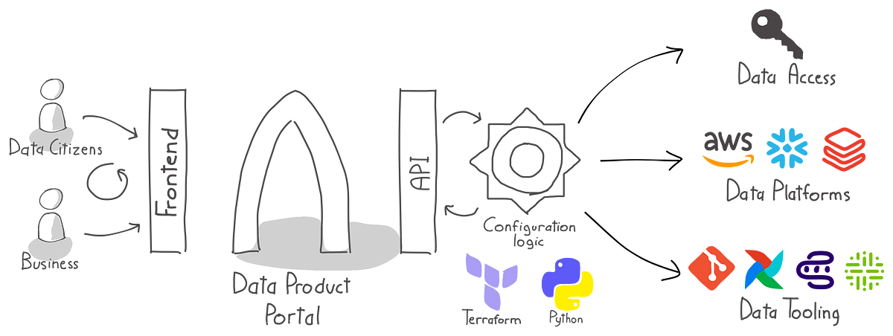

# Integrate portal in your landscape

The Data Product Portal helps you organize the process of building data products at scale in a self-service manner.

Most organizations leverage cloud data platform technologies like **AWS**, **Azure**, **Databricks**, **Snowflake**, etc.
This portal integrates with those platforms to streamline development workflows and governance.

---

## Overview

This section describes how to integrate the portal with your platform of choice. The [`integrations`](./integrations) folder provides **sample implementations** that translate portal configurations into:

- Data access configuration
- Platform tooling setup
- User permission mapping
- Data product lifecycle automation

### Currently Supported Integrations

- **AWS**: S3, Glue, Athena, Redshift
- **Conveyor**: A [self-service workflow manager](https://conveyor.dataminded.com/) for Data Products
- **Agno**: [An agent platform](https://www.agno.com/)
- **Azure**: Blob Storage
- **Databricks**: We support registering elements from the catalog
- **PostgreSQL**: The [open source object-relational database system](https://www.postgresql.org/). You can register schemas, databases, tables etc.
- **OSI**: [Open Semantic Interchange](https://open-semantic-interchange.org/) which registers your semantic layers
- **Snowflake**: You can register schemas, databases, tables etc

If there's a platform you want us to support, let us know — or better yet, open a PR!

## Automatically provisioning infra when Portal changes

To update your infrastructure automatically when portal changes we support provisioning via our SDK, you can find more
details in the[`How to use the provisioner SDK`](./provisioner.md)

## AWS Mapping

Here's how the core concepts of the Data Product Portal map to AWS resources:

| Portal Concept        | AWS Resource(s)                                                        |
|-----------------------|------------------------------------------------------------------------|
| **Data Environments** | S3 buckets, Glue databases/tables                                      |
| **Data Products**     | IAM roles/policies granting scoped access to S3 and Glue               |
| **Datasets**          | Groups of S3 paths and Glue tables                                     |
| **Data Outputs**      | Shareable outputs: S3 paths, Glue tables, Athena queries               |
| **Users**             | Access is managed via IAM roles and policies provisioned by the portal |

## Conveyor Mapping

| Portal Concept        | Conveyor Resource                                       |
|-----------------------|---------------------------------------------------------|
| **Data Environments** | Conveyor environments (execution isolation)             |
| **Data Products**     | Conveyor projects (build, deploy, run workflows)        |
| **Users**             | Portal-managed access to Conveyor projects and datasets |

The portal manages the mapping of users to Conveyor roles through its UI and API.
