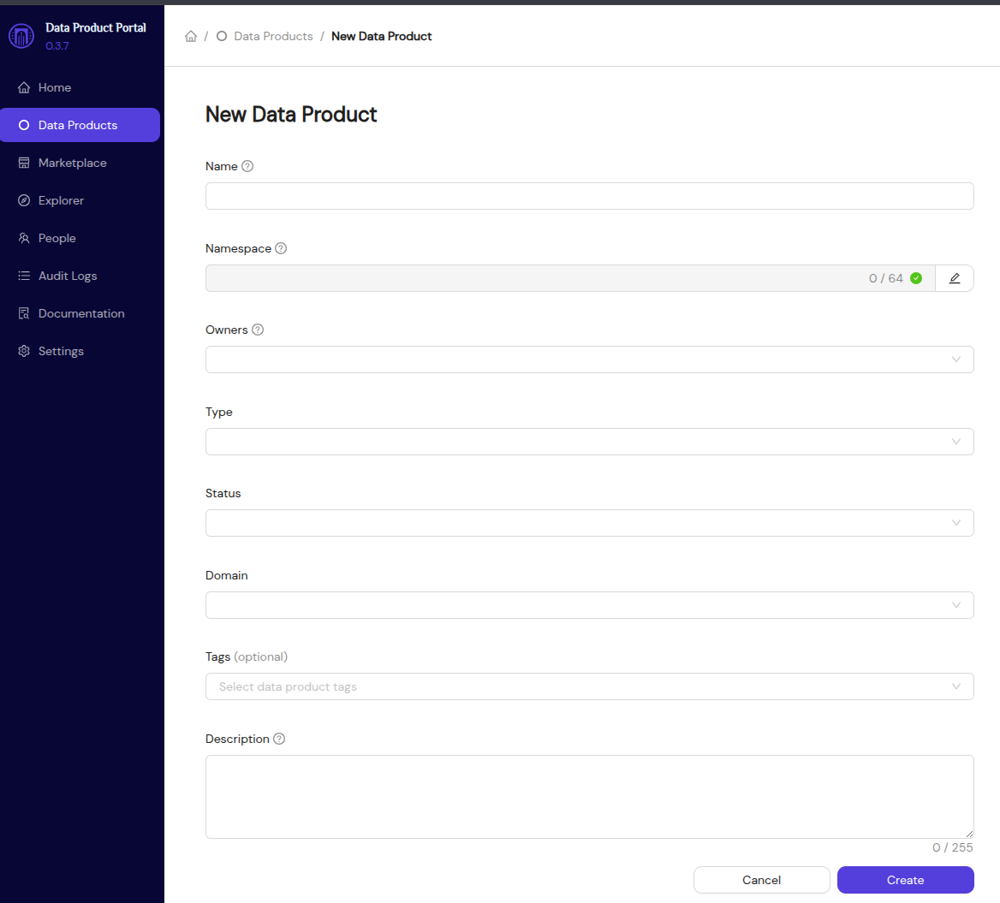
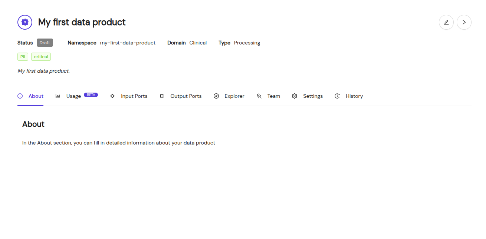

# Creating Data Products

## What is a Data Product?

A **Data Product** is a scoped data initiative with a clear objective, driven by a data product owner.
It includes data outputs and datasets, and it follows governance processes to ensure compliance with your organization's standards.
For more information have a look at the [Data Product](../concepts/data-products) concept.

## How to Create a Data Product

1. **Log in to the Portal**: First, make sure you have the necessary permissions to create a data product. If you’re unsure, ask your admin for access.
2. **Navigate to the 'Data Products' Page**: In the portal’s navigation, click on **Create Data Product**.
3. **Fill in the Details**: You’ll be asked to enter:
   - **Product Name**
   - **Namespace**: This generated field must be unique within your portal installation. It can not be changed after creation.
   - **Description**
   - **Product Owner** (typically your email address)
   - **Metadata**: Select the correct type, domain and status for your new data product.
4. **Submit the Product**: Once you’ve completed the form, click **Create**.

---

## The Detailed page

If the **Data Product** is created successfully you will navigate automatically to the detailed page.

We strongly encourage you to write a proper *About* page as this is the first encounter users will have with your **Data Product**.
Interesting things to include here are SLA's, contract specifications and an overview of the data one can expect.

On this page you can find all of the information regarding your **Data Product**. This includes the current team, status, domain and type.

You can also interact with the various enabled **tools and integrations**.

---

With each **Data Product** you'll receive a dedicated private working space to store your data. Storing data for later sharing can be done with **Data Outputs**.
Once you are confident about the look and feel of your brand new **Data Product** we can move on to creating a **Data Output** for it.
