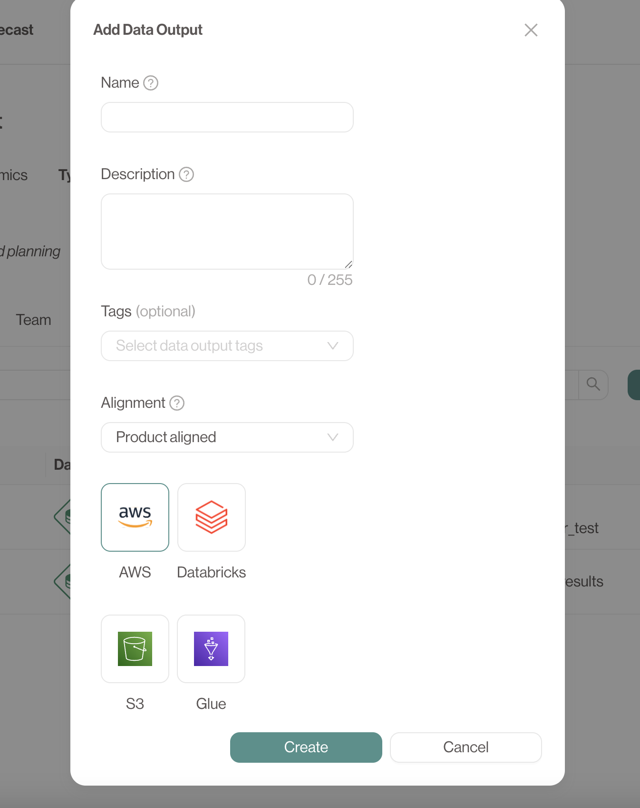
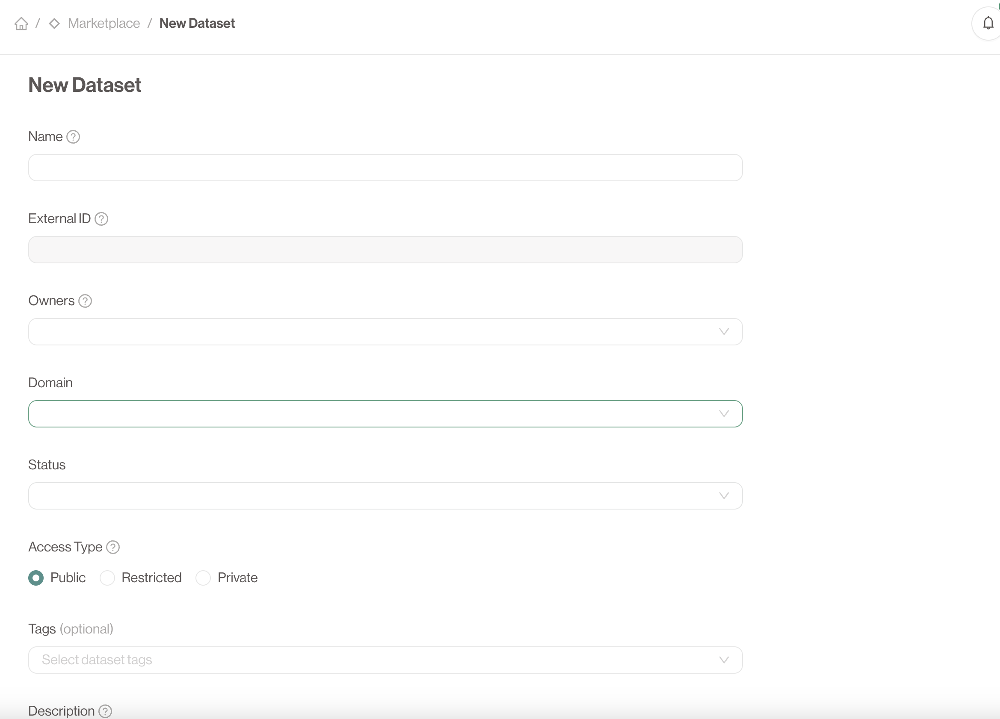

# Creating your first data Product

In this guide we will walk you through the creation flow of your product as well as connecting it with other products
and describing the data that it will product.
If you do not know what a Data product is, take a look at the [Data Product concept](../concepts/data-products).

## How to Create a Data Product

1. **Log in to the Portal**: First, make sure you have the necessary permissions to create a data product. If you’re unsure, ask your admin for access.
2. **Navigate to the 'Data Products' Page**: In the portal’s navigation, click on **Create Data Product**.
3. **Fill in the Details**: You’ll be asked to enter:
   - **Product Name**
   - **Namespace**: This generated field must be unique within your portal installation. It can not be changed after creation.
   - **Description**
   - **Product Owner** (typically your email address)
   - **Metadata**: Select the correct type, domain and status for your new data product.
4. **Submit the Product**: Once you’ve completed the form, click **Create**.

### The Detail page

If the **Data Product** is created successfully you will navigate automatically to the detailed page.

We strongly encourage you to write a proper *About* page as this is the first encounter users will have with your **Data Product**.
Interesting things to include here are SLA's, contract specifications and an overview of the data one can expect.

On this page you can find all of the information regarding your **Data Product**. This includes the current team, status, domain and type.

You can also interact with the various enabled **tools and integrations**.

## Creating a technical asset

Now that you have your data product, it is time to describe which technical assets, that your data product produces.
The full details about a technical assets can be found on the [concepts](../concepts/technical-assets.md) page.

Technical assets are linked to and owned by a single **Data Product**.

## How to add a technical asset to a Data Product

1. **Go to the Data Product that will expose the technical assets**
2. **Go to the Data Outputs Tab**: Once your data product is created, navigate to the **Data Outputs** tab within the product’s page.
3. **Click 'Add Data Output'**: You will need to have the correct access rights on the **Data Product** to be able to do this action.
4. **Specify Metadata**: Include necessary metadata such as:
   - **Output Name**
   - **Description**
   - **Type** Choose between *Product aligned* and *Source aligned*. See [below](#alignment)
   - **Technology** Choose from one of the enabled technologies within your organization.
   - **Technology specific information** Add some technical information such as database name and schema, prefix paths, ... This depends on the chosen technology.
4. **Save Your Data Output**: Click **Create** to add the data output to your product.

### Alignment

**Product aligned** Data Outputs are the default option.
These Data Outputs are created within the namespace of the parent **Data Product** and have the correct, restricted permissions.

**Source aligned** Data Outputs need to be explicitly approved by **Data Product Portal** administrators.
These can represent powerful ingestion **Data Outputs** that ingest from shared sources into different **Data Products** or **Datasets**.

## Creating an output port for your product

The output port describes which technical assets your data product exposes in a single interface.
It is the missing link when you want to share data with other data products
For more information about output ports, take a look at the [Output port concept](../concepts/output-ports.md).

### How to Create an Output port

1. **Navigate to the Datasets Section**: Go to the **Marketplace** page via the sidebar.
2. **Click 'Create Dataset'**: Provide a name for the dataset as well as a domain, owners, a status and a description.
3. **Set Access Type**: Define how Data Products get access to your data (See [below](#access-types)).
4. **Submit**: Once your dataset is configured, click **Create Dataset**.

### Access Types
There are currently 3 possible access types.

- Public: All access requests are immediately approved. Any Data Product can use your dataset as input.
- Restricted: Access requests are delivered to the dataset owners. These owners are in control over which Data Products can use the data downstream.
- Private: Private datasets don't show up in the overview. It is only possible to link to a private dataset if you are an owner of both the Dataset and the requesting Data Product.

## Conclusion

Congratulations, you succeeded in creating your first data product which can be used by others through:

- A clear description and about page of your product
- Identified the different technical assets that your produce
- Provide 1 or more interfaces that other data products can consume
