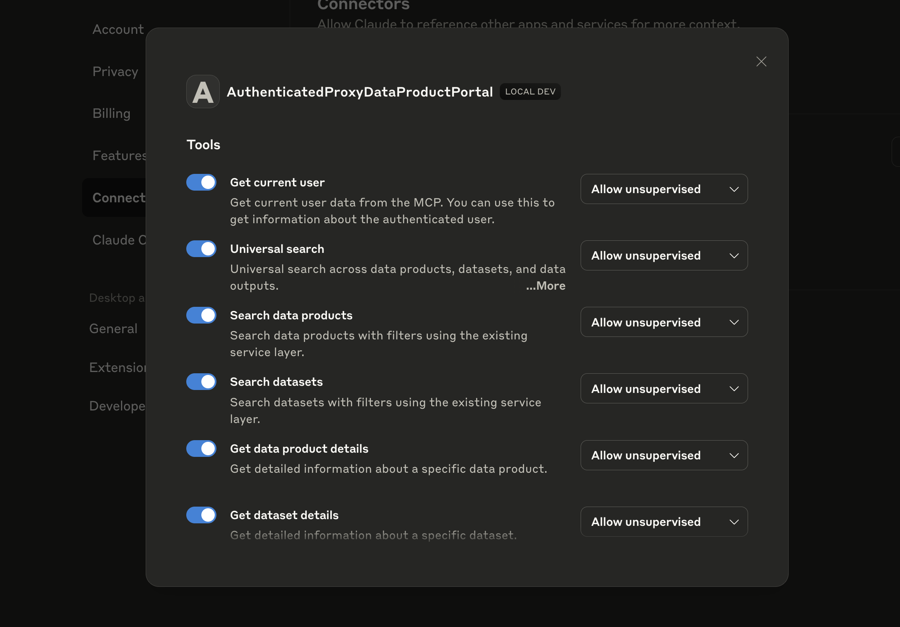
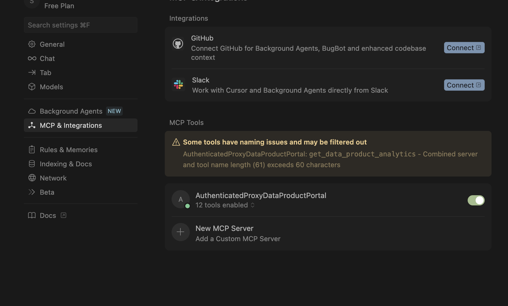

# Using the Portal's MCP server

As of version 0.3.5 the backend exposes several MCP tools.
The **MCP server** is an experimental way to interact programmatically with the Data Product Portal.
It allows you to:

- Look up the current contents of **data products** and **datasets**
- Explore **lineage** between datasets and data products
- Inspect the **roles** that users have on these resources

The MCP server can be integrated with any MCP client and has been tested with [Claude Desktop](https://claude.ai/download) and [Cursor](https://cursor.com).

:::warning
The MCP client is still experimental. Functionality may change, and it is not yet recommended for production use.
:::

### How to use the MCP client

Follow the steps below to get started:

#### 1. Install `uv`
The MCP client depends on [`uv`](https://github.com/astral-sh/uv).
Make sure it is installed and available on your system:

```bash
pip install uv
````

#### 2. Download the MCP proxy script

Download the MCP proxy script from the [following location](https://raw.githubusercontent.com/conveyordata/data-product-portal/refs/heads/main/mcp/remote_proxy.py).
For example:

```
wget https://raw.githubusercontent.com/conveyordata/data-product-portal/refs/heads/main/mcp/remote_proxy.py
```

Please note the path where you save the file.

#### 3. Configure your MCP client

Add the following JSON configuration to your MCP client setup:

```json
"dataProductPortal": {
  "command": "uv",
  "args": [
    "run",
    "--with",
    "fastmcp",
    "fastmcp",
    "run",
    "/absolute/path/to/remote_proxy.py"
  ],
  "env": {
    "ENDPOINT": "https://<your-portal-host>"
  }
}
```

* Replace `/absolute/path/to/remote_proxy.py` with the full path to the downloaded `remote_proxy.py` file.
* Replace `https://<your-portal-host>` with the actual endpoint of your Data Product Portal or `http:localhost:5050` if you are running locally.

Configuration for Claude Desktop is located at: `Settings > Developer > Edit config`
For Cursor you can find it at: `Cursor Settings > MCP & Integrations > New MCP Server`

### Usage

Once configured, you can run the MCP client to explore the portal:

* List available **data products**
* Inspect **datasets** and their metadata
* Follow **lineage** relationships
* Review **role assignments** of users

This makes it easier to integrate portal metadata into external tools, scripts, or workflows.

### Authentication

The MCP server follows the same authentication flow as your backend server.
It is possible that a reboot of your MCP client is needed after logging in to reset the MCP client.
(This happens e.g. on Claude Desktop).

### Available tools

After logging in you should see the tools that are available in the MCP Server.
With Claude Desktop you can verify this via `Settings > Connectors > Click on Configure for AuthenticatedProxyDataProductPortal`. 
You should see the list of tools.



In Cursor, you can check this with `Cursor Settings > MCP & Integrations > AuthenticatedProxyDataProductPortal > X tools enabled`.

