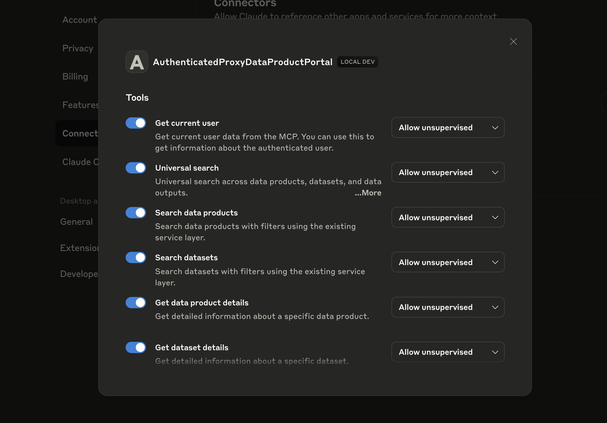

# Using the Portal's MCP server

As of version 0.3.5 the backend exposes several MCP tools.
The **MCP server** is an experimental way to interact programmatically with the Data Product Portal.
It allows you to:

- Look up the current contents of **data products** and **datasets**
- Explore **lineage** between datasets and data products
- Inspect the **roles** that users have on these resources

The MCP server can be integrated with any MCP client and has been tested with [VSCode](https://code.visualstudio.com/)
and [Jetbrains IDE github copilot plugin](https://plugins.jetbrains.com/plugin/17718-github-copilot--your-ai-pair-programmer).

:::warning
The MCP client is still experimental. Functionality may change, and it is not yet recommended for production use.
:::

### How to use the MCP server

The server speaks the **Streamable-HTTP** MCP transport with built-in **OAuth 2.1** support.
This is only supported as of Portal version 0.6.0.

The Portal MCP server needs to be configured to allow for the correct redirect URI's.

#### Vscode redirect URI's

```dotenv
MCP_AUTH_REDIRECT_URIS='["http://127.0.0.1:33418","https://vscode.dev/redirect"]'
```

#### Github copilot in jetbrains IDE's:

```dotenv
MCP_AUTH_REDIRECT_URIS='["http://127.0.0.1:*/callback"]'
```

### Github copilot app:

```dotenv
MCP_AUTH_REDIRECT_URIS='["http://127.0.0.1:*"]'
```

### Cursor:
```dotenv
MCP_AUTH_REDIRECT_URIS='["cursor://anysphere.cursor-mcp/oauth/callback"]'
```

### Claude desktop
```dotenv
MCP_AUTH_REDIRECT_URIS='["https://claude.ai/api/mcp/auth_callback"]'
```

Add the following JSON configuration to your MCP client configuration, this example users VSCode:

```json
{
	"servers": {
		"dataProductPortal": {
			"url": "https://<your-portal-host>/mcp/",
			"type": "http"
		}
	},
	"inputs": []
}
```

* Replace `https://<your-portal-host>` with the actual endpoint of your Data Product Portal (or `http://localhost:5050` if you are running locally).

The client will perform the OAuth flow automatically the first time it connects.


### Usage

Once configured, you can use the MCP client to explore the portal:

* List available **data products**
* Inspect **datasets** and their metadata
* Follow **lineage** relationships
* Review **role assignments** of users

This makes it easier to integrate portal metadata into external tools, scripts, or workflows.

### Available tools

After logging in you should see the tools that are available in the MCP Server.
With Claude Desktop you can verify this via `Settings > Connectors > Click on Configure for dataProductPortal`.

In Cursor, you can check this with `Cursor Settings > MCP & Integrations > dataProductPortal > X tools enabled`.


