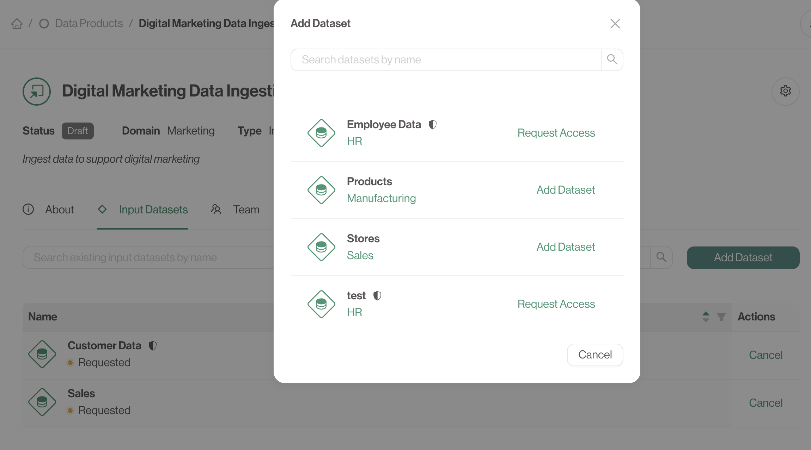

# The Final Step

We can now create and manage new **Data Products** using **Datasets**

### Using Datasets in New Data Products

Once you have datasets available, you can use them as **inputs** for creating new data products.
This allows you to build on top of existing data and extend its usage within your organization.

### How to Use Datasets in a Data Product

1. **Find your Data Product**: Either create a new Data Product like before, or navigating to an existing one.
2. **Select Input Datasets**: From the detailed **Data Product** page, go to the **Input Datasets** tab.
3. **Request Access**: Press **Add Dataset** and identify the right **Dataset**. Depending on the access type you will see either **Add Dataset** (for *public* datasets) or **Request Access** (for *restricted* datasets).
4. **Approval**: Once access has been requested, either approve it yourself if you are the owner, or wait until someone has approved your request.
Approvals are done from the **Consuming Data Products** tab from a **Dataset** detailed page.

---

## Conclusion

Congratulations! You’ve now completed the key steps for creating, managing, and sharing data products within the **Data Product Portal**. From here, you can continue expanding your data ecosystem, using datasets and data outputs to build scalable, governed data products.

If you need help along the way, refer to the portal’s **Documentation** section for more in-depth guides on each part of the process, or reach out to your organization’s admin for assistance.
