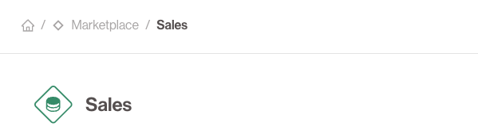

# 🔹 Datasets

**Datasets** are logical groupings of **Data Outputs** that serve as the primary unit of data access and sharing in the portal.

They allow **data consumers** (other data products) to request and consume governed collections of data.

## 🧩 What’s in a Dataset?

A Dataset might contain:
- An S3 export and a table
- One or more API endpoints
- Metadata, descriptions, schema info

## ✅ Access Management

- Dataset access must be **requested and approved**.
- Approvals go through the Dataset owner.
- Once granted, consumers can use the Dataset as an **input** to their own data product.

## 🔁 Reusability
Datasets allow **composability**: the output of one data product becomes the input to another.

## Representation
Within the Data Product Portal UI **Datasets** are always represented as **Diamonds**

---
