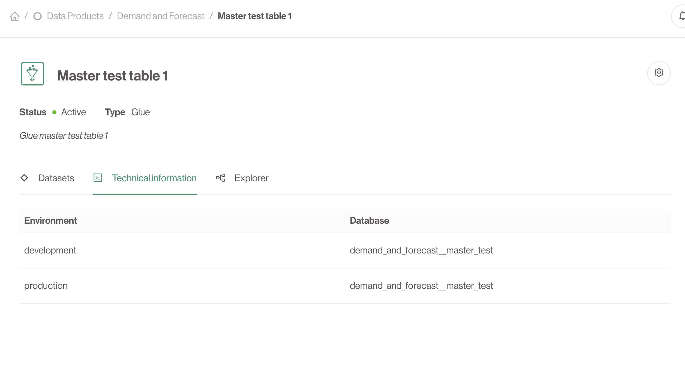

# Creating Data Outputs

## What is a Data Output?

A **Data Output** is a technical endpoint, such as an S3 bucket, a database table, or an API endpoint, where data is stored, shared, or accessed. Data outputs are created and managed within the context of a data product. For more information have a look at the [Data Output](../concepts/data-outputs) concept.

Data Outputs are linked to and owned by a single **Data Product**.

## How to add a Data Output to a Data Product

1. **Go to the Data Product that will expose the Data Output**: Data Outputs are linked to a single **Data Product**.
2. **Go to the Data Outputs Tab**: Once your data product is created, navigate to the **Data Outputs** tab within the product’s page.
3. **Click 'Add Data Output'**: You will need to have the correct access rights on the **Data Product** to be able to do this action.
4. **Specify Metadata**: Include necessary metadata such as:
   - **Output Name**
   - **Description**
   - **Type** Choose between *Product aligned* and *Source aligned*. See [below](#alignment)
   - **Technology** Choose from one of the enabled technologies within your organization.
   - **Technology specific information** Add some technical information such as database name and schema, prefix paths, ... This depends on the chosen technology.
4. **Save Your Data Output**: Click **Create** to add the data output to your product.

### Alignment

**Product aligned** Data Outputs are the default option. These Data Outputs are created within the namespace of the parent **Data Product** and have the correct, restricted permissions.

**Source aligned** Data Outputs need to be explicitly approved by **Data Product Portal** administrators. These can represent powerful ingestion **Data Outputs** that ingest from shared sources into different **Data Products** or **Datasets**.

---

## The Detailed page

Once the **Data Output** is created successfully it will appear in the list of **Data Outputs** in the *Data Output* tab.
Clicking on it will navigate you to the detailed view.

On this page you can find technical information on your **Data Output** depending on the chosen technology. You can also add the **Data Output** to a dataset from this page.

---

Congratulations! Now that you have created your first **Data Output** you have your own dedicated place to store the data you want to share with the rest of the organization from your **Data Product**. Sharing happens through **Datasets**, so let's move on and create a new **Dataset**.
