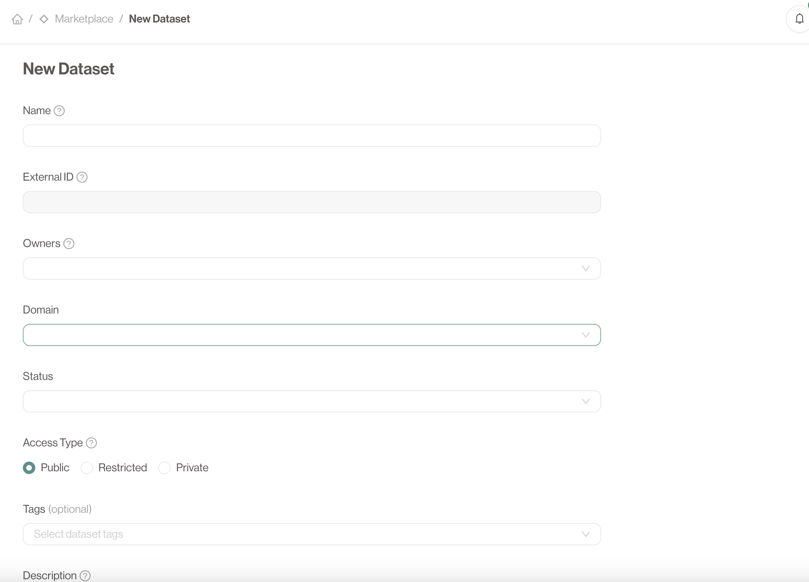
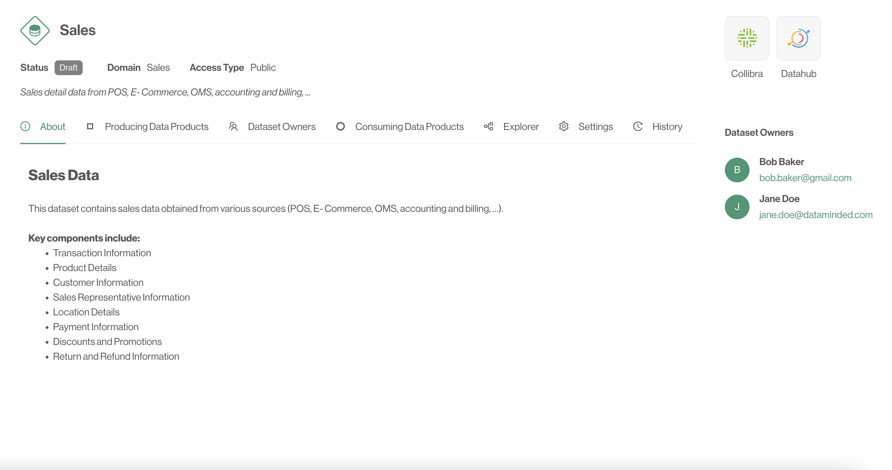

# Creating Datasets

### What is a Dataset?

A **Dataset** is a collection of data outputs grouped together for sharing or use by other products. Datasets grant **read access** to the data outputs they contain. These are governed and approved by dataset owners to ensure proper access control. For more information have a look at the [Dataset](../concepts/datasets) concept.

### How to Create a Dataset

1. **Navigate to the Datasets Section**: Go to the **Marketplace** page via the sidebar.
2. **Click 'Create Dataset'**: Provide a name for the dataset as well as a domain, owners, a status and a description.
3. **Set Access Type**: Define how Data Products get access to your data (See [below](#access-types)).
4. **Submit**: Once your dataset is configured, click **Create Dataset**.

### Access Types
There are currently 3 possible access types.

- Public: All access requests are immediately approved. Any Data Product can use your dataset as input.
- Restricted: Access requests are delivered to the dataset owners. These owners are in control over which Data Products can use the data downstream.
- Private: Private datasets don't show up in the overview. It is only possible to link to a private dataset if you are an owner of both the Dataset and the requesting Data Product.

---

## The Detailed page

If the **Dataset** is created successfully you will navigate automatically to the detailed page.

We encourage strongly to write a proper *About* page as this is the first encounter users will have with your **Dataset**.
Interesting things to include here are SLA's, contract specifications and an overview of the data one can expect.

On this page you can find all of the information regarding your **Dataset**. This includes the current team, as well as which **Data Products** provide data to this **Dataset** (via their **Data Outputs**) and which **Data Products** consume data from this **Dataset**.

You can also interact with the various enabled **tools and integrations**.

---

Congratulations! Now that you have created your first **Dataset** you can start linking concepts together.
This way you provide actual value to other users of the **Data Product Portal**.
