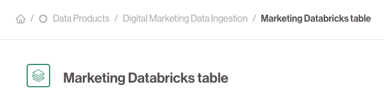

# 🟦 Data Outputs

**Data Outputs** are the technical access points created and exposed by Data Products. They represent the actual, physical data you can consume.

## 🔧 Examples

- An S3 path (e.g. `s3://sales-data/transactions/2024/`)
- A table in a database (e.g. `analytics.sales_transactions`)
- A Kafka topic (e.g. `sales-events-stream`)
- A REST API (`GET /sales/transactions`)

## 🔐 Governance

Each Data Output is registered, versioned, and described with:
- Access control rules
- Technical schema and metadata
- Ownership information

Consumers do **not access data outputs directly** — instead, they are bundled into Datasets that provide managed read access to consuming Data Products.

## Representation
Within the Data Product Portal UI **Data Outputs** are always represented as **Squares**

---
