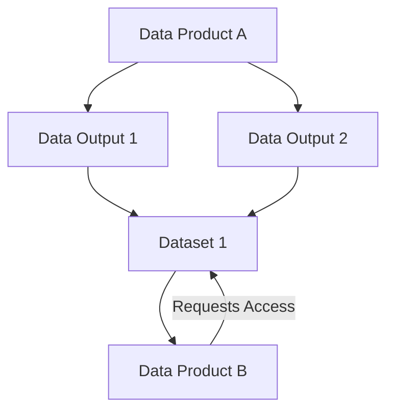
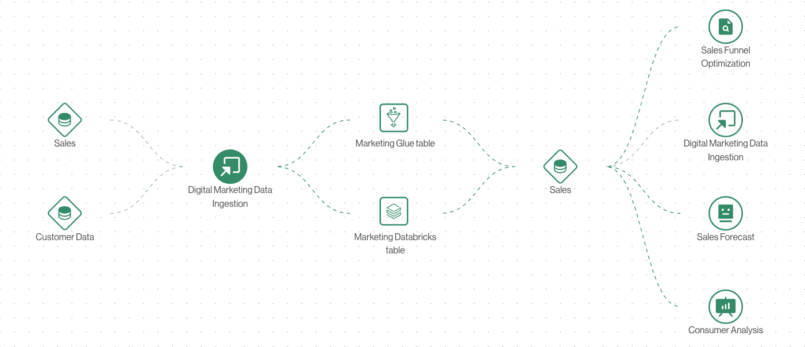

# 🔗 How Concepts Link Together

Here’s how **Data Products**, **Data Outputs**, and **Datasets** all fit into the broader architecture:

## 🧭 Flow Overview

## 🔁 Example Walkthrough

1. **Data Product A** creates two outputs: a Redshift table and an S3 export.
2. These outputs are bundled into **Dataset 1**.
3. **Data Product B** wants to use that dataset as input.
4. B requests access ➡️ A approves it ➡️ Access is granted.
5. Now, B can use the data from A as input in its own data processing.

## 🎯 Benefits

- Clear **ownership boundaries**
- **Composable** architecture
- **Request-based sharing** with full governance
- Easily auditable and traceable

## Representation
In the Explorer view you can always look at the lineage between **Data Products**, **Data Outputs** and **Datasets**
Pay attention to the shapes of each element to rapidly distinguish it's type.

---
