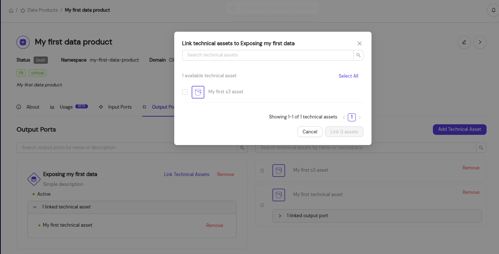
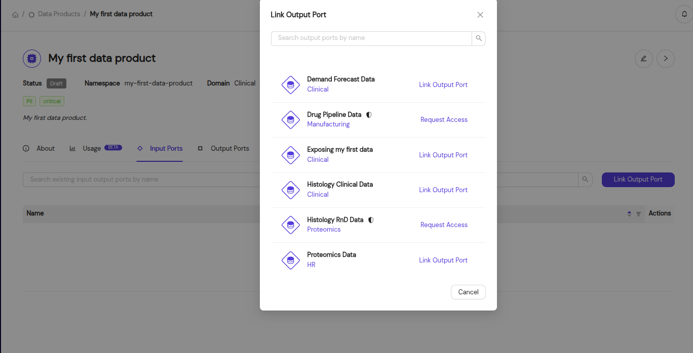

# Creating your first data Product

In this guide we will walk you through the creation flow of your product as well as connecting it with other products
and describing the data that it will product.
If you do not know what a Data product is, take a look at the page describing [data products](../concepts/data-products).

## How to Create a Data Product

1. **Log in to the Portal**: First, make sure you have the necessary permissions to create a data product. If you’re unsure, ask your admin for access.
2. **Navigate to the 'Data Products' Page**: In the portal’s navigation, click on **Create Data Product**.
3. **Fill in the Details**: You’ll be asked to enter:
   - **Product Name**
   - **Namespace**: This generated field must be unique within your portal installation. It can not be changed after creation.
   - **Description**
   - **Product Owner** (typically your email address)
   - **Metadata**: Select the correct type, domain and status for your new data product.
4. **Submit the Product**: Once you’ve completed the form, click **Create**.

### The Detail page

If the **Data Product** is created successfully, you will navigate automatically to the detail page.

We strongly encourage you to write a proper *About* page as this is the first encounter users will have with your **Data Product**.
Interesting things to include here are SLA's, contract specifications and an overview of the data one can expect.

On this page you can find all of the information regarding your **Data Product**. This includes the current team, status, domain and type.

You can also interact with the various enabled **tools and integrations**.

## Creating a technical asset

Now that you have your data product, it is time to describe the technical assets that your data product produces.
More information about technical assets can be found on the following [concept page](../concepts/technical-assets.md).

Technical assets are linked to and owned by a single **Data Product**.

## How to add a technical asset to a Data Product

1. **Go to the Data Product that will expose the technical assets**.
2. **Go to the Output Ports Tab**.
3. **Click 'Add a technical Asset'**: You will need to have the correct access rights on the **Data Product** to be able to do this action.
4. **Specify Metadata**: Include necessary metadata such as:
   - **Name**
   - **Description**
   - **Alignment** Choose between *Product aligned* and *Source aligned*. See [below](#alignment)
   - **Technology** Choose from one of the enabled technologies within your organization.
   - **Technology specific information** Add some technical information such as database name and schema, prefix paths, ... This depends on the chosen technology.
5. **Save Your Data Output**: Click **Create** to add the data output to your product.

### Alignment

**Product aligned** Technical Assets are the default option.
These assets are created within the namespace of the parent **Data Product** and have correct, restricted permissions.

**Source aligned** Technical assets need to be explicitly approved by **Data Product Portal** administrators.

When in doubt, choose **Product aligned**.

## Creating an output port for your product

The output port describes which technical assets your data product exposes through a common interface.
It is the missing link when you want to share the data-product's data with other data products.
For more information about output ports, take a look at the concept page describing [Output ports](../concepts/output-ports.md).

### How to Create an output port

1. **Navigate to the Output ports Section**.
2. **Click 'Add Output Port'**.
3. **Specify Metadata**: Include necessary metadata such as:
   - **Name**
   - **Owners**
   - **Domain**
   - **Status**: identifying the lifecycle stage of this output port.
   - **Access Type**: identifying who can see and request access to this output port. For more information, see [below](#access-types).
   - **Description**
4. **Submit**: Once your dataset is configured, click **Create Dataset**.

### Access Types
There are currently 3 possible access types.

- Public: All access requests are immediately approved. Any Data Product can use your dataset as input.
- Restricted: Access requests are delivered to the dataset owners. These owners are in control over which Data Products can use the data downstream.
- Private: Private datasets don't show up in the overview. It is only possible to link to a private dataset if you are an owner of both the Dataset and the requesting Data Product.

## Adding the technical assets to your output port
Now that you have created both technical assets and an output port, it is time to link them together.
1. **Go to the Data Product that will expose your data**.
2. **Go to the Output Ports Tab**.
3. **Link the technical assets to your output port**. You can drag the technical assets from the right side to the output port on the left side or use the Link technical asset link.

## (Optional) Creating an input port for your product
If your data product needs to consume data from other data products, you will need to create an input port.
For more information about input ports, take a look at the concept page describing [Input ports](../concepts/input-ports.md).

### How to Create an input port
1. **Navigate to the Data Product that will consume data**.
2. **Go to the Input Ports Section**.
3. **Click the 'Link Output Port' button**.
4. **Request access to the Output Ports that you need**. You can only use them after your request has been approved by the owners of the output port.

## Conclusion

Congratulations :tada:! you succeeded in creating your first data product and made it discoverable and consumable through:

- A clear description and an about page
- Identifies the technical assets that will be produced
- Provides at least 1 interface that other data products can use to consume the data
- Optionally, consumes data from other data products through input ports
