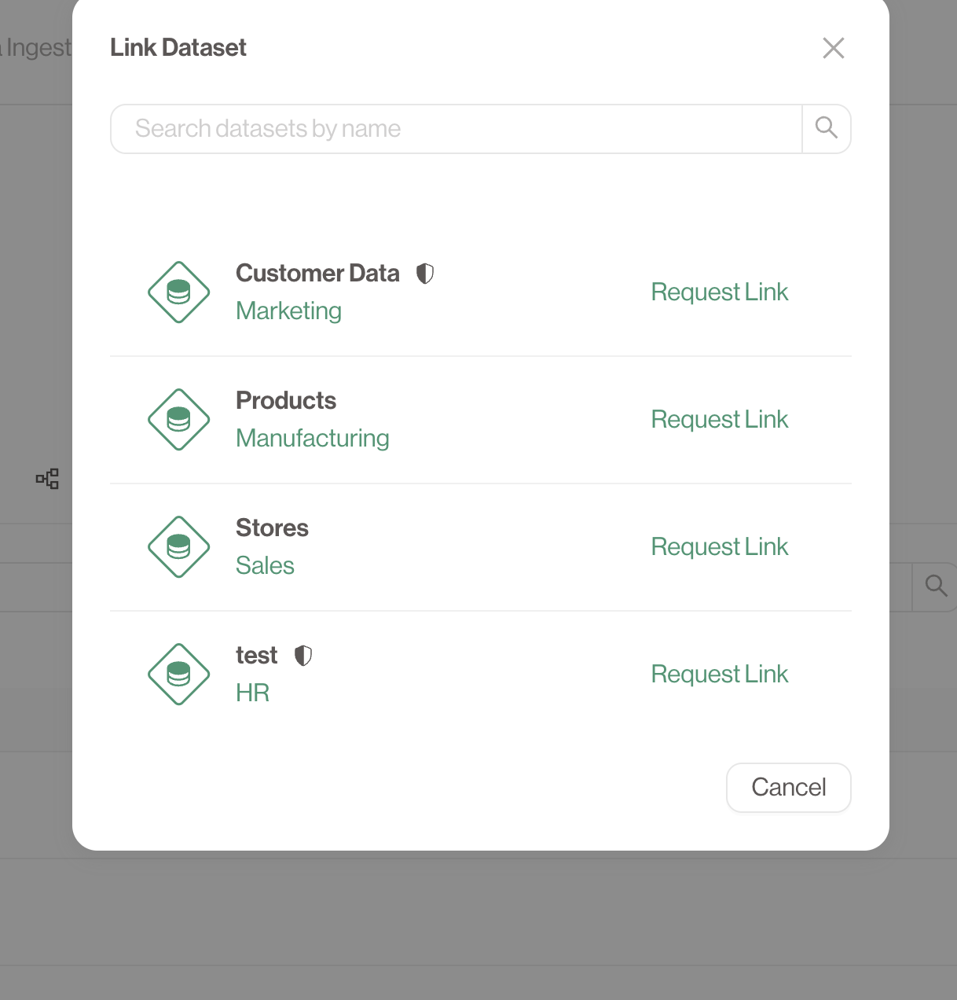
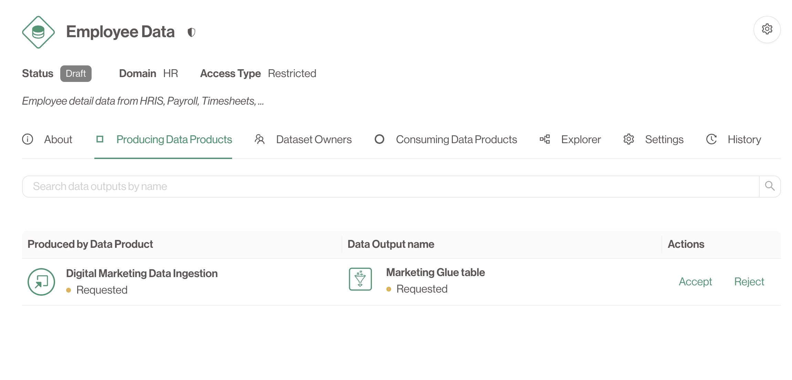
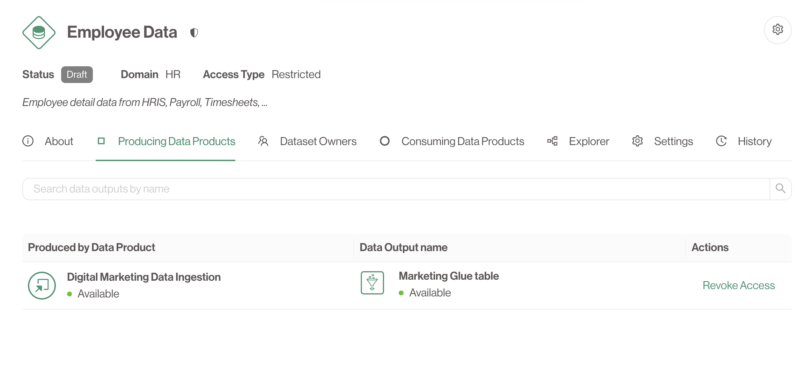

# Linking Everything Together

## How to bundle Data Outputs into Datasets
To make sure a **Dataset** exposes the data you want. You first need to link your **Data Output** to that **Dataset**.

1. Navigate to the **Data Product** which is the parent of the **Data Output** you would like to link to a **Dataset**.
2. Go to the **Data Outputs** tab and click on the name of the **Data Output** you want to add.
3. Click **Add Dataset**.
4. Select the **Dataset** you want to add by clicking **Request Link**.

An approval is now send out to the owners of that **Dataset**, unless it is Public.
If you selected the **Dataset** you just created, we can now accept the request.

---

## Accepting Data Outputs into your Dataset
You can immediately navigate to the **Dataset** by clicking it's name from the **Data Output** detailed view. Alternatively, you can also find it via the **Marketplace**.

1. Move to the **Producing Data Products** tab.
2. Either the request is pending (if the **Dataset** is *restricted*) or it was automatically approved (*public* dataset).
3. If the request is pending you can now **Accept** or **Reject** the request. If you are an owner of the **Dataset**.
4. Regardless of the access type, if you are an owner of the **Dataset** you can always **Revoke Access** that was previously granted. Be careful though, as this might have impact on downstream depending **Data Products**.

Congratulations, you have successfully linked your **Data Output** to a **Dataset**.
Now every **Data Product** with access to the **Dataset** can also read the data from your exposed **Data Output**.
