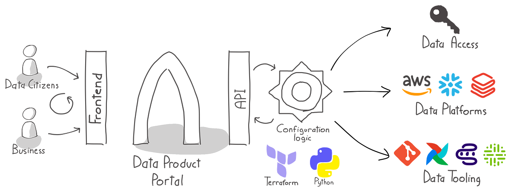

# Data product portal sample implementations
The data product portal is a tool that helps you organise building data products at scale in a self-service manner. 
Companies usually use data platform technologies like AWS, Azure, Databricks, Snowflake, etc to do this. For that reason
you need to link the data product portal to your data platform. This document describes how you can do that.

The integrations folder provide you with sample implementations that translate the data product portal configuration to
the configuration that are required to configure data access, platform tooling, user access and more from a data product
development point of view. We currently support the following integrations:
- **AWS**: S3, Glue, Athena, (Redshift serverless coming soon)
- **Conveyor**: A data product workflow manager that helps you build data products in a self-service manner

We intend to add support for other data platform technologies in the future. If you have a specific request, please let 
us know. Upcoming integrations are:
- Data platforms ie. Databricks, Snowflake, Azure
- Data catalogs ie. Amundsen, Datahub, Collibra

## AWS
The data product portal introduces the concept of data environments, data products, datasets and data outputs. These
concepts are translated to AWS resources in the following way:
- **Data environments**: a group of S3 buckets and Glue databases/tables where your data products can store their data
- **Data products**: a group of data environment specific IAM roles and permissions that grant you access to specific 
  paths in your datalake buckets, glue databases/tables and grant you access to the glue metastore and Athena services
- **Data outputs**: Data outputs are the result of a data product made available for sharing via a dataset and can be
  a group of S3 paths and Glue databases/tables. Data outputs are data platform technology specific.
- **Datasets**: a group of S3 paths and Glue databases/tables that are considered a dataset
- **Users**: are allowed to access the data products and datasets via the data product portal. The data product portal
  will manage the user access via the IAM roles and permissions that are created for the data products.

## Conveyor
- **Data environments**: maps to a Conveyor environment where you can run your data product workflows in a separated way
- **Data products**: maps to a Conveyor project that provides you with a workspace where you can build, deploy and run
  your data product workflows. Data products run in a data environment and will have default access to the right data 
  product/environment IAM role.
- **Users**: are allowed to access the conveyor projects and datasets via the data product portal. The data product portal
  will manage the mapping of users to conveyor automatically via the data product portal UI.

## Portal integration
The configuration of resources is done via terraform and can be found in the terraform folder. The terraform 
integration can be done in the following way:
1. Configuring the terraform setup
2. Running the terraform code with the sample configuration files
3. Retrieving the configuration files from the data product portal
4. Updating the terraform configuration with the retrieved configuration files

More information on how to perform these steps can be found in the [terraform](./terraform/README.md) folder.